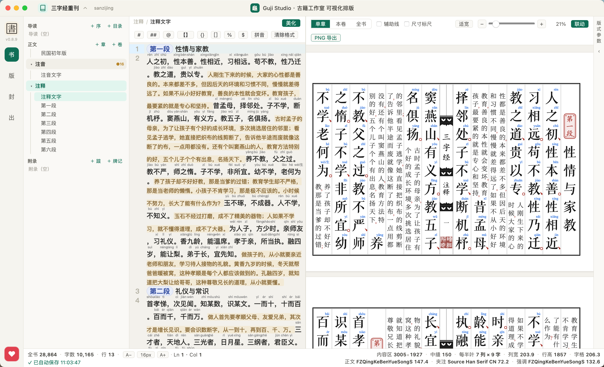
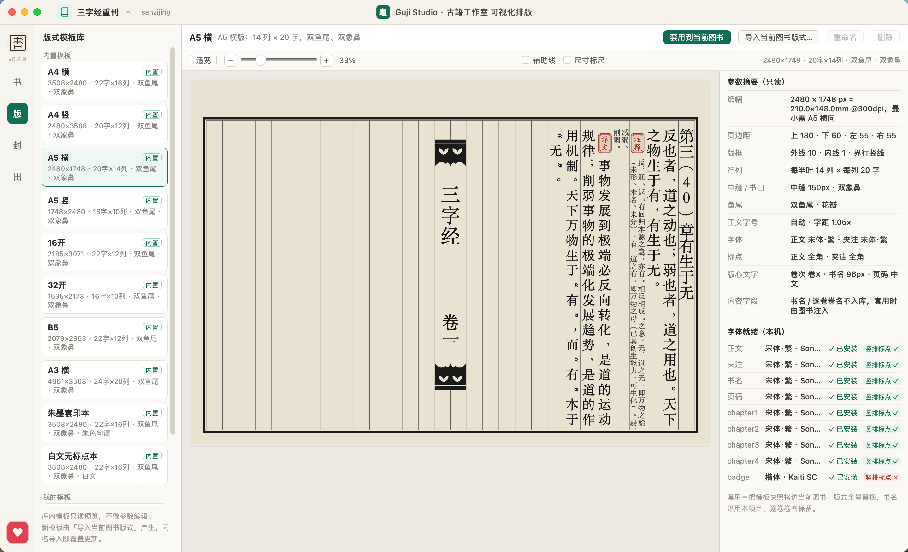
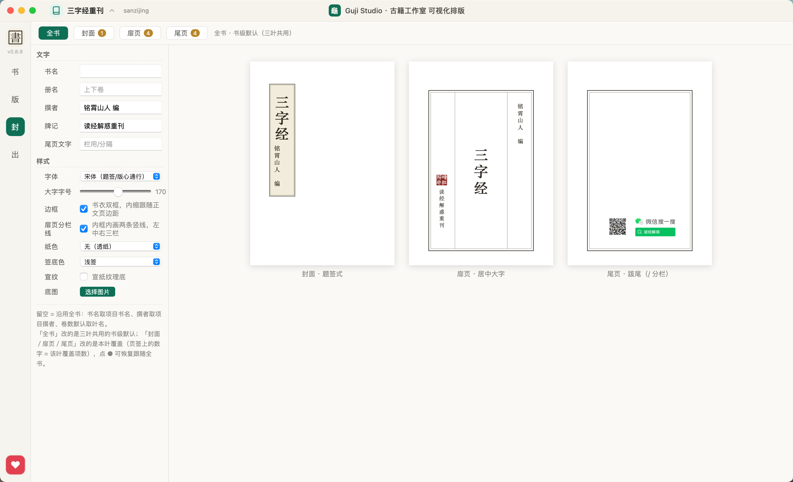
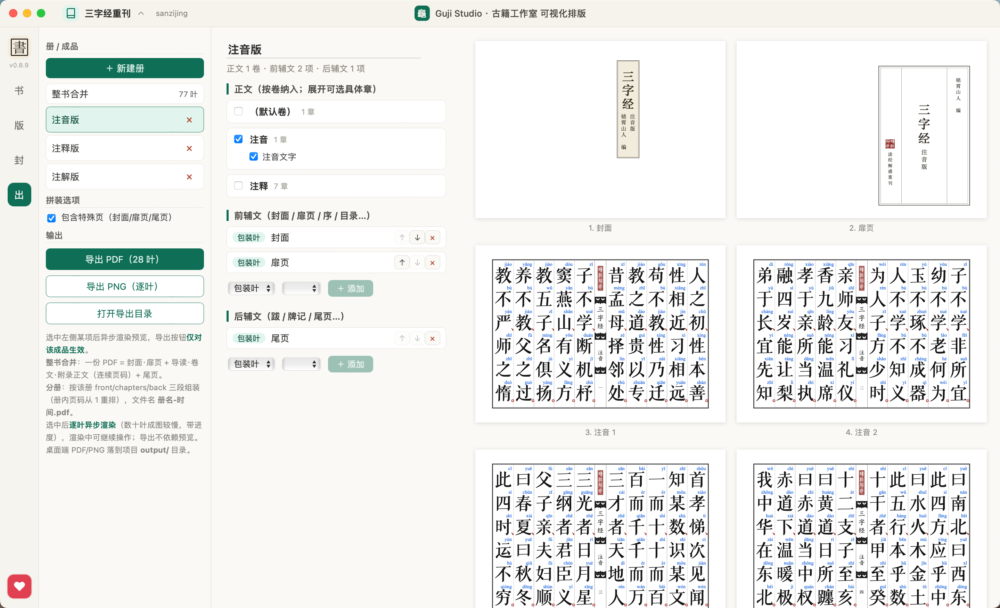

# GujiStudio · 古籍工作室

一款面向古籍整理与复刻的**桌面排版工具**：以现代输入（简体/繁体文本 + 现代标点）为源，按传统刻本的版式规范，输出竖排、句读圈点、带封页与牌记的古籍页面，并导出为 SVG / PDF。

> 设计目标：让整理者专注于「文字内容」与「版式参数」，把断句、圈点、版心、边框、封面这些刻本要素交给引擎自动完成——同一份源文本，可在「现代整理本」与「影刻本」之间一键切换。



---

## 核心特性

- **竖排古籍版式引擎**：纯 TypeScript 实现、无 DOM 依赖的排版内核（`core/engine.ts`），从「版式模板 + 文本」算出页码与坐标，再渲染为合法 SVG（可直接光栅化导出）。
- **句读圈点**：现代标点 `. ， ； ： ！ ？` 经渲染期映射为古籍形态——`、`（读点，用字形保笔锋）+ `○`（句圈，矢量自绘、可控直径与线宽）。与「悬空」同路、不占字格，可染朱；源文件始终保留现代标点，切换无损。
- **标点模式四选一**：正文 / 夹注标点各支持 `全角占格 / 悬空小字 / 句读圈点 / 白文不渲染`，并可在预览器中 `Ctrl/⌘ + 滚轮` 捏合缩放、± 按钮步进。
- **册·卷·章三层结构**：
  - **册** = 独立装订单元（可各自拥有封面 / 扉页 / 版式 / 尾页）；
  - **卷** = 文内 `%` 表达的内容单元；
  - **章** = 文章池中的单篇，按引用组装进册。
  - 册支持「前辅文 / 正文 / 后辅文」有序分组编辑（封面、扉页、序、目录、跋、牌记可勾选编排）。
- **特殊页**：封面、扉页、尾页（牌记）独立参数，跟随正文页边距双框；目录由卷文**自动派生**，永不落盘、不与源文件断链。
- **模板库**：内置预设模板 + 用户自定义模板（由 Go 后端 `TemplateService` 统一持有）；版式参数支持「书级默认 + 册级差异覆盖」（`resolve`，只存差异字段，书级改动自动同步）。
- **预览与导出**：单章 / 本卷 / 全书合订三种预览范围；导出每册一份 PDF，导出处走 SVG → Image 光栅化，错误信息带叶序 + 叶标签。

---

## 界面一览

### 版式模板库

内置 A4 / A5 / 16 开 / 32 开 / B5 / A3 横 / 朱墨套印本 / 白文无标点本等预设；选中任一模板，右侧即时列出纸张、页边距、版框、行列、中缝、鱼尾、字号与字体等全部参数，可一键套用到当前图书。



### 封面 · 扉页 · 尾页

封面（题签式）、扉页（居中大字）、尾页（牌记 / 分栏）三页各有独立参数——字体、字号、边框、纸色、签底色、底图，预览随输入即时更新。



### 出版导出

册按「前辅文 / 正文 / 后辅文」有序编排，可勾选是否包含特殊页；右侧预览即最终产物，逐叶可核对（图中为注音版），支持导出 PDF（每册一份）与逐叶 PNG。



### 关于与赞助

应用内可以查看许可、版本检查、项目主页与赞助方式。


---

## 技术栈

| 层 | 技术 |
|---|---|
| 桌面壳 | [Wails 3](https://v3.wails.io/)（`v3.0.0-beta.4`，Go `1.25`） |
| 前端 | Vue 3 + TypeScript + Vite，Pinia 状态管理 |
| 编辑器 | CodeMirror 6（竖排古籍文本编辑） |
| 排版内核 | 纯 TypeScript（`src/core/`），SVG 渲染 |
| 导出 | `pdf-lib` |
| 后端服务 | Go：`ProjectService` / `SettingsService` / `FontService` / `TemplateService` |

> 仅桌面端（Wails 壳）。`npm run dev` 仅供浏览器冒烟，调 Wails API 会失败；正式验证请用 `wails3 dev` / 桌面壳。

---

## 架构

```
┌─────────────────────────────────────────────┐
│  Wails 桌面壳 (main.go)                       │
│  · 注册 Project/Settings/Font/Template 服务   │
│  · .gvs 文件关联、拖拽打开、Mac 无边框窗口     │
└───────────────┬─────────────────────────────┘
                │ Wails runtime (前端 import @wailsio/runtime)
┌───────────────▼─────────────────────────────┐
│  Vue 前端 (src/)                              │
│  ├─ SystemRail      系统栏（视图切换）         │
│  ├─ SidebarPanel    册·卷·章 树               │
│  ├─ EditorPanel     CodeMirror 编辑           │
│  ├─ PreviewPanel    内容预览（缩放 ±/滚轮）    │
│  ├─ LayoutPanel     版式模板预览              │
│  ├─ InspectorPanel  版式参数编辑             │
│  ├─ CoverPanel      封面/扉页/牌记            │
│  ├─ ExportPanel     导出                      │
│  └─ PubPanel        册分组编辑                │
│                                                 │
│  ├─ stores/app.ts   Pinia 全局状态            │
│  └─ core/          排版内核（无 DOM 依赖）     │
│       ├─ engine.ts   分页+渲染（SVG）          │
│       ├─ schema.ts   版式参数 schema          │
│       ├─ presets.ts  模板库（内置+摘要）       │
│       ├─ special.ts  特殊页                   │
│       └─ toc.ts      目录派生                 │
└─────────────────────────────────────────────┘
```

**关键约束（来自项目实践）**
- 排版核心 `engine.ts` 为纯函数（`paginate` / `renderPage` / `computeMetrics`），不依赖 DOM，可独立跑探针、可迁移。
- SVG 必须是合法 XML：属性值一律走 `esc()`，绝不 `JSON.stringify`；根标签显式给 `width`/`height`，否则 `Image` 固有尺寸为 0、导出失败。
- Wails 桥接：只有 **service struct 的方法**才生成前端绑定；改完 Go service 需 `wails3 generate bindings`。

---

## 项目文件模型

图书项目 = 三文件 + 目录（位于项目文件夹根）：

| 文件 | 作用 |
|---|---|
| `book.gvs` | 书名 / 作者 / 书级版式默认 / 包装叶覆盖 |
| `setting.json` | 文章池 `chapters`、卷 `volumes`、固定角色 `guide`/`appendix`、包装叶 `packs` 覆盖 |
| `publish.json` | 册数组（每册独立装订：封面/扉页/版式/尾页 + 前辅文/正文/后辅文分组） |

磁盘布局：
```
<项目>/
├─ book.gvs        # 书级元数据
├─ setting.json    # 文章池 / 卷 / 固定角色 / 包装叶覆盖
├─ publish.json    # 册（装订单元）定义
├─ text/           # 全部章平铺 <标题>.txt
├─ guide/          # 序.txt
├─ appendix/       # 跋.txt / 牌记.txt（目录派生永不落盘）
├─ trash/          # 改名/删除章的旧文件（可找回）
└─ output/         # 导出产物
```

> 源文本**永远存现代标点**；句读圈点是渲染期映射，不污染源文件——今天排句读本、明天排整理本，同一份源切一下即可。

---

## 快速开始

### 开发模式
```bash
# 桌面壳（含前端热重载 + Go 绑定）
wails3 dev
```

### 构建 / 打包
```bash
wails3 build          # 产物在 build/
wails3 build GOOS=windows   # 交叉编译（Windows）
```

### 仅前端冒烟（不支持 Wails API）
```bash
cd frontend && npm install && npm run dev
```

---

## 目录速览

```
GujiStudio/
├─ main.go                 # 桌面壳入口：注册服务、.gvs 关联、拖拽打开
├─ go.mod                  # gujistudio (Go 1.25)
├─ internal/services/      # Project / Settings / Font / Template 服务
├─ frontend/
│  ├─ src/
│  │  ├─ core/            # 排版内核（engine/schema/presets/special/toc）
│  │  ├─ stores/         # Pinia 状态 (app / dialog)
│  │  └─ components/     # 五区 UI + 封面/导出/册编辑视图
│  └─ package.json
└─ build/                 # Wails 构建/打包脚本（跨平台 Taskfile）
```

---

## 状态与路线

当前为**未发布的内测版本**，核心排版链路（竖排、句读、册卷章、特殊页、模板、导出）已可用，细节仍在迭代。后续方向：

- 「刻本句读」内置预设模板（圈径 + 朱色 + 悬空一键套用）；
- `normalize` 命名空间：简→繁、阿拉伯数字→汉字数字、横排引号→竖排「」等字符语义转换；
- 封面/扉页的可视化设计器与更多传统纹样（象鼻、鱼尾、版框）。

---

## 许可

Copyright (C) 2026 dinstone &lt;dinstone@163.com&gt;

本项目以 **[GNU Affero 通用公共许可证第 3 版](./LICENSE)（AGPL-3.0）** 发布。你可以自由使用、修改与分发，但须遵守其条款。

与 GPL-3.0 的关键差异在于**第 13 条（Remote Network Interaction）**：若你修改本项目并通过网络向用户提供其功能（例如部署为在线服务），必须向这些用户提供对应的完整源代码。**分发桌面端 / 安装包等常规分发行为则不触发该条，与 GPL-3.0 义务相同。**

完整条款见 [LICENSE](./LICENSE)；若需以其他条款（如商业许可）使用，请联系版权持有人。
